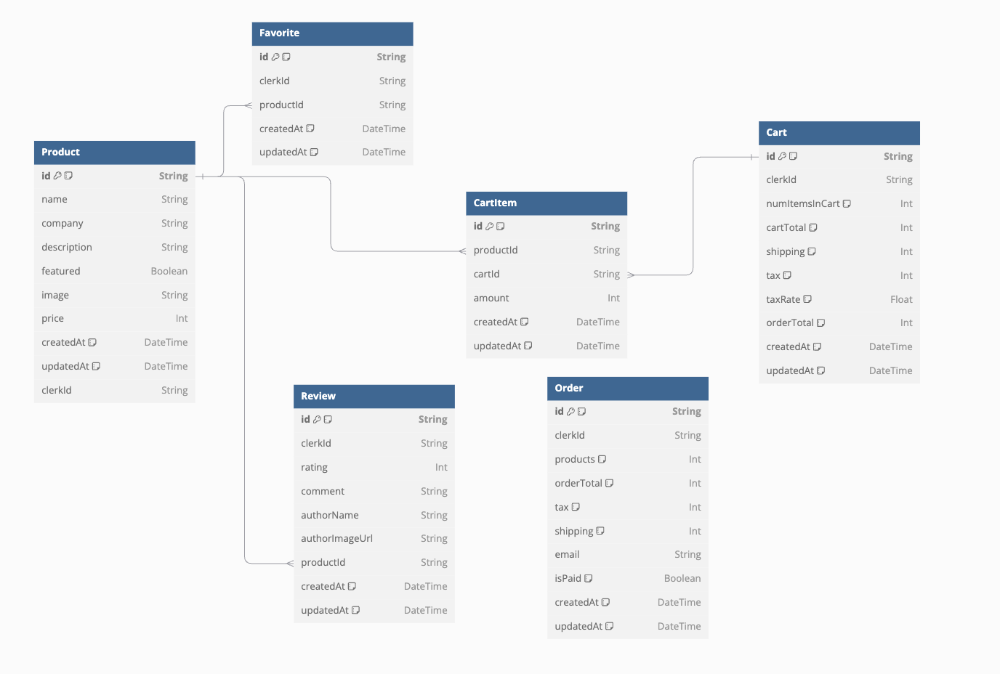

# Shanghai-BrightBolt-Trading-Co.-Ltd.
Tailwind, Shadcn UI, React

# how search works
the NavSearch component allows users to change the search parameter, which affects the product page parameters in the address. Here's how it works:

The useSearchParams hook retrieves the current search parameters from the URL.
The useRouter hook provides the replace function to update the URL.
The search state is initialized with the current search parameter from the URL.
The handleSearch function updates the search parameter in the URL using the replace function.
The useEffect hook ensures that the search state is reset if the search parameter is removed from the URL.
The Input component allows users to type a search query, which updates the search state and calls handleSearch to update the URL.
When the search parameter in the URL changes, the ProductsPage component will receive the updated search parameter and pass it to the ProductsContainer component to filter and display the products accordingly.

# when to use use client
'use client' means run on the clients device 
'use client' is used because the component:

Uses React hooks (useState, useEffect).
Uses the useSearchParams and useRouter hooks from next/navigation, which are client-side hooks.
Interacts with the DOM (e.g., handling input changes).
hooks: Hooks allow you to reuse stateful logic across different components without changing the component hierarchy
# when to use suspense
## 1. suspense boundary(https://nextjs.org/docs/messages/missing-suspense-with-csr-bailout)
Reading search parameters through useSearchParams() without a Suspense boundary will opt the entire page into client-side rendering. This could cause your page to be blank until the client-side JavaScript has loaded.
refer to navsearch
## 2. suspense async loading
In React, Suspense is used to handle the loading state of components that rely on asynchronous data fetching. refer to products homepage

# supabase for upload photos
* supabase create bucket 
* supabase SDK and api setup

# supabase sync the delete function
delete func in admin/products/page->toast and delete ->sync the supabase(need helper function)

# favorite functionality
1. revise the datastructure in backend in schema.prisma page
2. npx prisma generate, npx prisma db push, npx prisma studio
   1. to seed the data : node prisma/seed
   2. npx prisma generate: Generates the Prisma Client based on your schema.
   3. npx prisma db push: Applies changes in your Prisma schema to your database schema.
   4. npx prisma studio: Opens a web-based GUI for interacting with your database.
3. toggle button->toggle form (formcontainer)-> toogle action and change icon(CardSubmitButton)
    1. toogle fav button: first fetch all fav id
    2. toogle fav form: pass to formcontainer and call toggleFavoriteAction (create or delete a favorite based on the favoriteId), and change CardSubmitButton UIicon

# deployment
vercel: copy env and env.local key as env vars

# reviews system:
   1. reviews page under certain products
   2. reviews page under user
   3. write reviews to db 
   4. restrict to review for second time 

# cart and cart items 
   1. cart item column && third column->124item list 
   2. cartTotals

# database(https://dbdiagram.io/d/67463ea6e9daa85acacf8216)

- Deletion cascades are configured for Favorite, Review, and CartItem models.
- If a Product is deleted, all related favorites, reviews, and cart items are automatically removed to maintain database integrity.